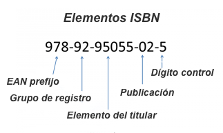

# EJERCICIO EXTENDER BIBLIOTECA

[Ver enunciado ejercicio anterior](EnunciadosPropuestosClase.md#gestión-de-biblioteca)

Eres parte de un equipo de desarrollo de software para una compañía de gestión de bibliotecas. Necesitas diseñar un sistema para manejar la información de libros prestados por los usuarios.

Los detalles de los libros y usuarios deben estar protegidos y solo accesibles a través de métodos específicos.

Además, se requiere abstracción para representar los préstamos de libros y su gestión

---

Vamos a hacer crecer nuestra biblioteca.

Ahora, además de libros, vamos a tener revistas y publicaciones. Estos tres elementos tienen en común isbn, título y 
autor o autores.

El isbn es un código marcado por un estándar ISO, imaginemos que sus características son las siguientes:
- Debe contener 13 números
- Consta 5 elementos separados por espacios o guiones.
- Y la cantidad de dígitos entre guiones viene indicada en la siguiente imagen:
 

Todos los elementos se pueden prestar menos las revistas. 

Que se puedan prestar implica que tenemos que saber que persona se ha llevado el libro o publicación.
Que el préstamo dura 15 días.
Los usuarios que no devuelvan en el tiempo indicado los elementos, serán penalizados con 1 mes sin prestamo.  
