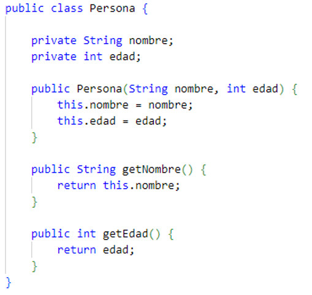
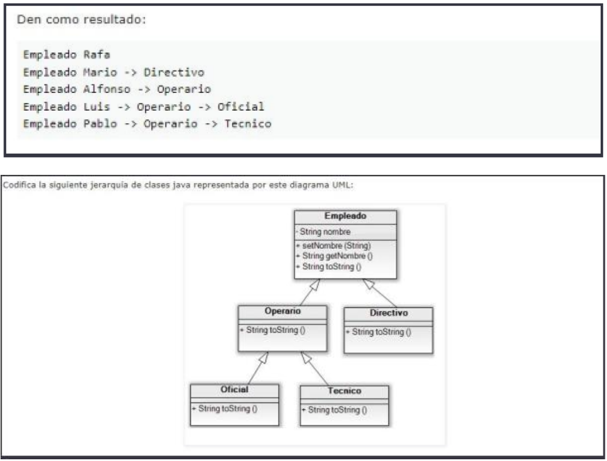

# EJERCICIOS ABSTRACCIÓN, ENCAPSULACIÓN Y OCULTACIÓN

## Abstraete

Abstrae las características de una casa e imprímela por pantalla utilizando los atributos de la clase casa en
“Private”, debe tener al menos 5 atributos. Para finalizar, imprime los atributos por pantalla.

[Solución](abstraccion/Main.java)

## Caja mágica

Un aventurero encuentra una caja mágica en uno de sus viajes.

La caja puede guardar un solo objeto dentro de ella, pero es un truco: cada vez que el objeto se saca de la caja, se
pierde.

Crea un programa para que un usuario dé nombre a un aventurero que encuentre la caja. El aventurero podrá ver los
contenidos de la caja e interactuar con ella (meter y sacar objetos).

- Debes crear diversas clases, una por cada objeto que necesites.
- Protege debidamente los métodos y atributos que creas convenientes.
- El usuario deberá recibir por pantalla el nombre del aventurero y el objeto con el que interactúa cada vez que use
  la caja (usa métodos set y get).

[Solución](caja_magica/Principal.java)

## Gestión de biblioteca

Eres parte de un equipo de desarrollo de software para una compañía de gestión de bibliotecas.
Necesitas diseñar un sistema para manejar la información de libros prestados por los usuarios.

Los detalles de los libros y usuarios deben estar protegidos y solo accesibles a través de métodos específicos.

Además, se requiere abstracción para representar los préstamos de libros y su gestión

[Solución](biblioteca/GestionBiblioteca.java)

# EJERCICIOS HERENCIA Y POLIMORFISMO

## Crea estudiante

A partir de la siguiente clase:

Construye una clase 'Estudiante' con los atributos: nombre, edad y créditos matriculados.
Solo hace falta que imprima por pantalla la información indicada, si quieres modificar la información para que aparezca
de forma diferente puedes hacerlo como quieras.

[Solución](estudiante/Main.java)

## Herencia de empleado

La clase padre es la clase “Empleado”. Esta clase contiene: un atributo privado “nombre” de tipo String que heredan
el resto de clases. Un constructor por defecto, un constructor con parámetros que inicializa el nombre con el String que
recibe, métodos “set” y “get” para el atributo nombre, un método toString() que devuelve el String “Empleado” + nombre.

El resto de clases solo deben sobrescribir el método toString() en cada una de ellas y declarar el constructor adecuado
de forma que cuando la ejecución de las siguientes instrucciones:

    Empleado E1 = new Empleado("Rafa");
    Directivo D1 = new Directivo("Mario");
    Operario OP1 = new Operario("Alfonso");
    Oficial OF1 = new Oficial("Luis");
    Tecnico T1 = new Tecnico("Pablo");
    System.out.println(E1);
    System.out.println(D1);
    System.out.println(OP1);
    System.out.println(OF1);
    System.out.println(T1);

Den como resultado:

[Solución](herencia_empleado/GestionEmpleados.java)

## Formas geométricas

El objetivo de este ejercicio es aplicar el concepto de polimorfismo en Java para calcular áreas de diversas formas
geométricas. Se proporciona un esquema de clases que incluye una clase padre “FormaGeometrica” y varias clases hijas
como
“Circulo”, “Cuadrado”, y “Triangulo”.

FormaGeometrica (Clase padre):

- Contiene un atributo protegido “tipo” que indica el tipo de forma geométrica.
- Tiene un método abstracto “calcularArea()” que deberá ser implementado por las subclases.
- Incluye un método para mostrar información general sobre la forma geométrica.
- En la clase principal, crea instancias de diferentes formas geométricas y muestra su información utilizando
  polimorfismo.
- Ejecuta el programa y verifica que se calculen y muestren correctamente las áreas de las formas geométricas.

[Solución](formas_geometricas/PruebaPolimorfismoFormas.java)

## El parking

Ejercicio para poner a prueba la comprensión de herencia y polimorfismo.

Elaborar las clases necesarias, con la relación de herencia que se parezca lo máximo posible a la vida real, para
modelar vehiculos, vehiculos con motor, bicicletas(sin motor), coches y motos.

Elaboremos también una clase Parking, con dos funcionalidades posibles: aparcar y dejarLibre. No es necesario
implementar su funcionalidad. Aparcar necesita como entrada el vehículo a aparcar y nos devuelve el número de la
plaza de aparcamiento donde se ha aparcado el vehículo. El método dejarLibre, necesita cómo parámetro de entrada el
número de la plaza que se va a liberar y retorna el vehículo que estaba aparcado en esa plaza.

El main hará lo que cada uno quiera que haga, pero tratemos de buscar situaciones en las que tengamos que
utilizar el polimorfismo, el casting, uso de método getClass() e instanceOf.

[Solución](polimorfismo/melissa_parking/Principal.java)
[Solución](polimorfismo/hugo_parking/ControlParkimetro.java)
[Solución](polimorfismo/angel_parking/Parking.java)

# EJERCICIOS STRINGBUILDER y STRINGBUFFER

## Concatenando palabras

Escribe un programa que pida una lista de palabras y utilizando ‘StringBuilder’ concatenar todas las palabras para
finalmente mostrar por pantalla el resultado.

## Snake case

Escribe un programa que recoja una cadena en formato Camel Case y utilizando StringBuilder convertirla a Snake Case.

Ejemplo: nuevoMensajeOculto  nuevo_mensaje_oculto

## Capicua

Escribe un programa que compruebe si un número es capicúa utilizando StringBuffer.

## Yellow sun

Escribe un programa que elimine los seis primeros caracteres de la cadena “Yellow Sun” mediante el uso de StringBuffer.
