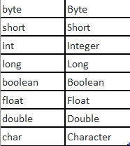

# PROGRAMACIÓN ORIENTADA A OBJETOS AVANZADA

<!-- TOC -->
* [PROGRAMACIÓN ORIENTADA A OBJETOS AVANZADA](#programación-orientada-a-objetos-avanzada)
  * [CLASES WRAPPER (ENVOLTURA)](#clases-wrapper-envoltura)
  * [REFERENCIA THIS](#referencia-this)
  * [MODIFICADOR STATIC](#modificador-static)
  * [MODIFICADOR 'FINAL'](#modificador-final)
  * [COMBINAR 'FINAL' con 'STATIC'](#combinar-final-con-static)
<!-- TOC -->

## CLASES WRAPPER (ENVOLTURA)

Repasando... Los tipos de datos que podemos tener en un desarrollo Java:
- Primitivos: son elementos que no son objetos, y, por lo tanto, no tienen métodos.
- No primitivos: son los objetos, y, por lo tanto, tiene métodos.

Para todos los tipos de datos primitivos, existen unas clases llamadas wrapper, que proveen una serie de mecanismos 
que "envuelven" el dato primitivo en un objeto, permitiéndonos así, tratarlos como si fueran objetos.

Cada tipo primitivo tiene asociado su correspondiente wrapper:

[DEMO que muestra como cambiar entre tipos primitivos y clases envoltura](DemoWrappers.java)

## REFERENCIA THIS

Dentro de un método de instancia de clase o un constructor, esta es una referencia al objeto actual. Puede hacer
referencia a cualquier miembro del objeto actual.

El uso más habitual es para diferenciar variables con nombres repetidos u ocultas. Veamos la diferencia entre estas dos declaraciones:

    public class Punt {

      private int x; 
      private int y;

      public Punt(int a, int b) { 
          x = a;
          y = b;
      }

Con ocultación de variables:

    public class Punt { 

      private int x; 
      private int y;
  
      // constructor con variables sombreadas
      public Punt(int x, int y) { 
          this.x = x;
          this.y = y;
      }

Otra aplicación común del this es la siguiente:

    public class Punt {

      private int x; 
      private int y;
      private static int cantidadPuntos;

      public Punt(int x, int y) { 
          cantidadPuntos++;
          this.x = x;
          this.y = y;
      }

      public Punt(){
          this(0, 0);  //Siempre debe ir en la primera fila y ser lo primero que se ejecuta
          cantidadPuntos++; // ¿Esto tendría sentido? 
      } 

En este caso hemos usado this, para, en el constructor vacío, llamar a otro constructor, creando un valor inicial 
para x e y.
Cuando se da la situación del ejemplo, la referencia a this debe ser lo primero en ejecutarse.

__Atención:__ También se ha añadido una llamada al incremento del contador, pero... como nuestra llamada this, va a 
llamar al constructor con parámetros, que a su vez, ya incorpora el incremento del contador, esto sería un error.

## MODIFICADOR STATIC

Una clase, método o campo declarado como estático puede ser accedido o invocado sin la necesidad de tener que instanciar un objeto de la clase. 

Un muy buen ejemplo de uso, tanto de métodos, como de atributos static es la clase Math:

    public static void main(String[] args) {
        double floorOfPi = Math.floor(Math.PI); //PI, es una variable estática
        System.out.println(floorOfPi);
    }

__Nota__: Para utilizar ambos, es necesario invocar al atributo o al método utilizando NombreClase.nombreAtributo.

Usar static en atributos o métodos implica que ese elemento será compartido por todas las instancias de la clase. En 
lugar de generarse un nuevo elemento en memoria cada vez que llamemos a la clase, este elemento estará una única vez en memoria para todos 
los usos de esa clase, habrá una única copia de él.
Las clases estáticas son aquella que no pueden ser instanciadas, y ello obliga a que todos sus miembros deben ser
estáticos.

Características:
- Una clase puede combinar atributos y métodos estáticos con otros que no lo son, ejemplo, la clase String. 
- Un método static NO puede acceder a atributos de la clase que no sean static
- Un método no static SÍ puede acceder a atributos static
- Los métodos static NO pueden usar la referencia this, ya que este hace referencia a una instancia concreta de la 
  clase. Tengamos en cuenta que 'this' nunca se podrá utilizar para hacer referencia a elementos estáticos, ya que se
  utiliza para referenciar elementos de una instancia (un objeto actual), es decir, es algo dinámico.
- Si un método no usa los atributos de la classe, es candidato a ser estático.
  
[Demo en una clase conocida Punt](Punt.java)

## MODIFICADOR 'FINAL'

Como ya hemos visto con anterioridad, cuando añadíamos el modificador 'final' a una variable, lo que hacíamos era 
convertirla en una constante, de forma que esa variable no podía cambiar su valor.

A partir de aquí, el concepto final está relacionado con la herencia, que veremos un poco más adelante:

- Si aplicamos el modificador 'final' a un método, este no podrá ser redefinido en una subclase. 

- Si lo aplicamos a una clase, lo que implicará es que esta clase no podrá ser modificada ni ampliada por nadie, es 
decir, no podrá tener clases hijas.

## COMBINAR 'FINAL' con 'STATIC'

Es habitual encontrar los elementos con el modificador 'final' que además incluyen el modificador 'static'.

    public class Constantes {

      public static final float PI = 3.141592f;

      public static final void imprimirPi() { 
          System.out.println(PI);
      }

Los atributos de clase declarados de esta manera, con static, deben inicializarse en el momento de su declaración, 
ya que posteriormente, su valor no va a poder cambiarse. 

¿Qué sentido tiene hacerlo así? Una constante nunca va a poder ser modificada, por lo tanto, si la hacemos estática, 
evitamos que con cada instanciación de la clase se cree una nueva. Y lo mismo para métodos finales.

Para una explicación más visual de static os sugiero acudir a [Aula en la Nube, que lo detalla con gran precisión](https://aulaenlanube.com/zona-programacion/java/tema-5-poo-java-programacion-orientada-objetos/curso-java-static/)
