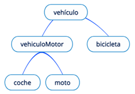
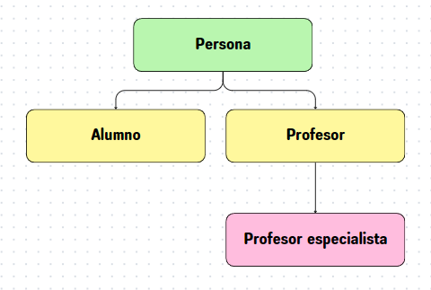
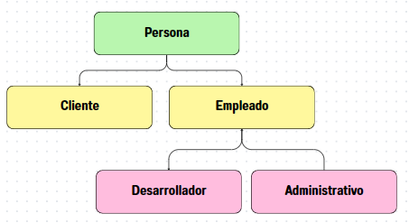
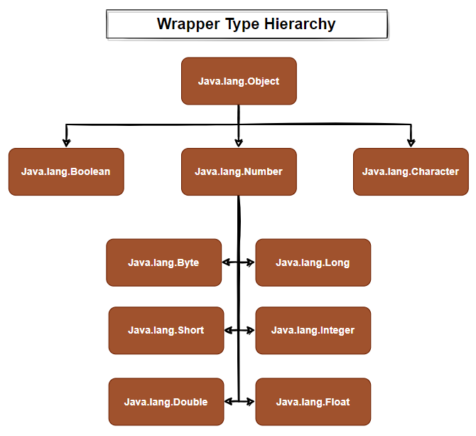

# PROPIEDADES FUNDAMENTALES DE LA POO

<!-- TOC -->
* [PROPIEDADES FUNDAMENTALES DE LA POO](#propiedades-fundamentales-de-la-poo)
  * [1. ABSTRACCIÓN](#1-abstracción)
  * [2. ENCAPSULACIÓN Y OCULTACIÓN](#2-encapsulación-y-ocultación)
    * [Ejercicios sobre Televisor:](#ejercicios-sobre-televisor)
  * [3. HERENCIA](#3-herencia)
    * [Clase Object](#clase-object)
    * [REFERENCIA SUPER](#referencia-super-)
    * [RECORDATORIO: Modificador Final](#recordatorio-modificador-final)
  * [4. POLIMORFISMO](#4-polimorfismo)
    * [CASTING](#casting)
<!-- TOC -->

## 1. ABSTRACCIÓN

Es el proceso mediante el cual se modela una entidad del mundo real (tangible), en forma de código, en este caso, Java, 
para poder ser representada en forma de clase, a través de sus atributos y métodos.
Para ello, para abstraer correctamente un objeto, este, se debe observar y ser capaz de poner en perspectiva, 
estudiando su comportamiento para luego poder aplicarlo en un código que lo modele en forma de objeto.

Consiste también en tener en cuenta solo ciertos aspectos de un objeto, desde un punto de vista determinado y no 
tener en cuenta los restantes aspectos que no sean necesarios para el objetivo del programa.

## 2. ENCAPSULACIÓN Y OCULTACIÓN

Son dos conceptos orientados al mismo fin: proteger los detalles de la configuración de una clase.

Encapsulación significa reunir a todos los elementos que pueden considerarse pertenecientes a una misma entidad.

La ocultación protege a las propiedades de un objeto contra su modificación por quien no tenga derecho a acceder a
ellas, solamente los propios métodos internos del objeto pueden acceder a su estado o características.

Ambos conceptos están enfocados en que una clase sea como una caja negra. La clase solo permite acceso a lo que
se puede hacer con ella, pero oculta los datos que la forman y como se han implementado los métodos. Lo que una
clase permite hacer con ella, lo ofrece su API.

El objetivo es crear objeto cuya funcionalidad se mantenga intacta, así todo aquel que use esa clase, podrá seguir
usándola aunque cambie la implementación de los métodos que la componen.

Entre otros mecanismos para implementar estas dos características, java dispone de los niveles de
acceso: public, private y protected.

[Entrar en este enlace para ver en más detalle los niveles de acceso.](2_1_NivelesAcceso.md)

[Demo Televisor](Televisor.java)

### Ejercicios sobre Televisor:
- Crear un main que cree dos televisores y pruebe los métodos actualmente declarados.
- Modificar la clase para que permita gestionar el volumen y sus valores estén entre 0 y 15. Si se intenta subir el 
  volumen más de 15, se mantendrá en 15 y si se intenta bajar más de 0, se quedará en 0.
- Mas ejercicios sobre Televisor en [Aula en la Nube](https://aulaenlanube.com/zona-programacion/java/tema-5-poo-java-programacion-orientada-objetos/curso-java-ejercicios-oo-clase-televisor/)

## 3. HERENCIA

La herencia se basa en dos conceptos conocidos: La jerarquía y la reutilización.

La jerarquía es algo que vemos en la vida real en muchos ámbitos, algo inherente a los sistemas, y lo que hace es organizar estos en escala de forma ordenada, de mayor a menor o viceversa.
Cuando se desarrolla con reutilización se da valor al código, en inglés lo resume el término "DRY", Don't Repeat Yourself (no te repitas).

La herencia es la transmisión del código entre unas clases y otras. Para soportar un mecanismo de herencia tenemos dos clases: la clase padre y la/s clase/s hija/s (JERARQUÍA). 

La clase padre es la que transmite su código a las clases hijas como si realmente las clases hijas llevaran dentro el código de la clase "Padre" (REUTILIZACIÓN).

Java permite múltiples niveles de herencia, pero no la herencia multiple, es decir una clase solo puede heredar
directamente de una clase ascendiente.

Una clase puede ser ascendiente de tantas clases descendiente como se desee (un unico padre, multitud de hijos). En
la siguiente figura se muestra gráficamente un ejemplo de jerarquía entre diferentes clases relacionadas mediante la herencia.

Ejemplo:

    //Clase padre
    Class Vehiculo(){
      int numruedas;
    }
    
    //Ejemplo clases hijo con niveles de herencia
    Class VehiculoMotor extends Vehiculo(){
      string matricula;
    }

    Class Coche extends VehiculoMotor(){…}

    Class Bicicleta extends Vehiculo(){…}

Ejemplo de personas con diferentes funciones:
[Demo Jerarquía](jerarquia/Main.java)

A tener en cuenta:

- No se recomienda declarar en las clases hijas un atributo con el mismo nombre que uno del padre, de forma que
  oculte a este.
- La sobreescritura de métodos del ascendiente está permitida y es recomendable informarlo mediante la anotación
  @Override. Haciendo esto, el método de la clase ascendiente queda oculto.
- Los métodos de clase o estáticos (declarados como static) y los que incluyen el modificador final, no deben ser 
  redefinidos, ya que podemos incurrir en errores. [DEMO ocultar static](herencia/Cat.java)
- Los métodos públicos de la superclase, són públicos en la subclasse. 
- Los métodos protegidos de la superclase, en la subclase pueden ser protegidos o público, pero no privados.

[Otro Demo Jerarquía](jerarquia/ejemplo_empresa/Persona.java)

### Clase Object

Todas las classes heredan de java.lang.Object. 

La clase Object tienen los métodos siguientes y se pueden usar en cualquier clase hija:
- equals,  
- hashCode, 
- toString y 
- clone

Lo conveniente suele ser sobreescribirlos, para modificarlos a conveniencia para nuestra clase.

Sobreescribirlos requiere marcarnos con la anotación @Override, esto será utilizado como información tanto por otros 
desarrolladores (en la API se informa de ello) como por el compilador.

[Entrar en este enlace para más detalle de los métodos sobreescritos](2_3_OverrideMetodosObject.md)

Por ejemplo, veamos la herencia de las clases Wrapper:

Imagen extraída de [https://profile.es/blog/clases-wrapper-envoltorio-en-java/](https://profile.
es/blog/clases-wrapper-envoltorio-en-java/)

### REFERENCIA SUPER 

[Entrar aquí para más detalle](2_2_ReferenciaSuper.md)

### RECORDATORIO: Modificador Final

Utilizar la palabra final en clases y métodos, está relacionado con la herencia:
- Si un método de una superclase se declara como final, implica que sus subclases no pueden sobreescribir este 
  método y si lo intentan, el entorno mostrará un error.
- Una clase declarada con la palabra reservada final no puede tener clases descendientes. Por ejemplo, la clase Math 
  de Java, está declarada como final.

## 4. POLIMORFISMO
El polimorfismo es una cualidad muy ventajosa que se refiere a que un elemento puede tomar varias formas. En programación es un concepto muy relacionado a la herencia y que sólo tiene sentido en los lenguajes de programación fuertemente tipados, como es Java. Cuando nos encontramos ante lenguajes como php o javascript, que son débilmente tipados, este concepto pierde su valor.
¿Qué es un lenguaje fuertemente tipado? Aquel que al declarar una variable es necesario asignarle siempre un tipo, o
al declarar un objeto, le tiene que asignar siempre una clase.

Por ejemplo, cuando creamos:

    Coche mama = new Coche();

Si intentamos hacer:

    mama = new Moto(); 

Dará un error en tiempo de compilación, la variable mama siempre va a ser un coche, nunca va a poder ser una moto.

Ahora utilicemos herencia y polimorfismo:

    Vehiculo mama = new Coche();
    Mama = new moto(); 

En este caso no fallará, coche y moto son clases hijas de vehículo, como hemos visto en el ejemplo de la herencia.
Así a simple vista, quizá es difícil verle la utilidad, pero vamos a ver otro ejemplo:

Imaginemos la clase Parking, que tiene un método para aparcar “Vehículos”. Sin polimorfismo sería necesario definir un método aparcar para cada clase de vehículo.

    Class Parking{
      int precio;
      …
      
      void aparcar(Coche c){…}
      
      void aparcar(Bicicleta b){…}
    }
    
    //Como llamaríamos al método aparcar
    Parking p = new Parking;
    p.aparcar(mama);

Por el contrario, gracias al polimorfismo podemos hacer lo siguiente:

      Class Parking{
        int precio;
        …
        
        void aparcar(Vehiculo v){…}
      }

En este ejemplo la llamada al método sería exactamente igual que en el ejemplo anterior, con la diferencia que, si dentro de un año en este código queremos añadir las clases “Bus” o “Barco” o “Triciclo”, el código de parking no requerirá modificación, mientras que, en el primer ejemplo, requerirá añadir un método para cada una de ellas.

Como resumen, el polimorfismo es el mecanismo por el cual podemos "relajar el sistema de tipos", de modo que nos acepte también objetos de las clases hijas o derivadas.

[Demo Jerarquía](jerarquia/MainPolimorfismo.java)

En el siguiente ejemplo veremos herencia, polimorfismo y uso de static
[Demo Animales](herencia/Cat.java)

### CASTING

Es posible aplicar casting entre objetos de clases con las que haya una relación de herencia.

    // Casting implícito - La clase superior puede contener una instancia de una hija
    Object a = new Coche();

    // Pero no se permite y dará un error en tiempo de compilación
    Coche mio = a;

    // Pero sí le hago el casting explícito sí podré hacerlo
    Coche mio = (Coche) a;
