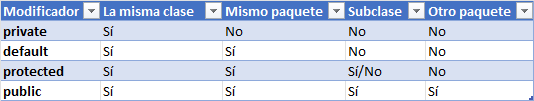

# NIVEL DE ACCESO

El nivel de acceso define la visibilidad de una clase, de sus variables y de sus métodos.

Tenemos los tipos de acceso siguientes:
- __private__, el más restrictivo:
    - Para clase: define una clase accessible, únicamente, per la clase donde está escrita.
    - Para métodos o variables: define un elemento que solo puede ser accedido dentro de la misma clase. Ninguna otra
      clase sin importar la relación que tenga con ella, podrá tener acceso a ellos.
- __protected__:
    - Para clase: Define una clase accessible por las clases del mismo paquete y sus subclases.
    - Para métodos o variables: define un elemento que puede ser accedido dentro de la misma clase, por las clases del
      mismo paquete y las clases que heredan de esta.
- __public__, el menos restrictivo:
    - Para clase: define una clase accessible por cualquier otra clase del proyecto o por otras que importen el paquete.
    - Para métodos o variables: define un elemento que puede ser accedido desde cualquier clase, sin importar
      procedencia de esta.

- No escribir nada, implica que usamos el nivel por __default__ es la otra opción disponible e implica que la clase
  solo será accesible por otras clases definidas en el mismo paquete (clases amigas).

### Tabla resumen

En un fichero .java solo se puede definir una clase pública y como ya sabemos, el nombre del fichero debe coincidir
con el nombre de la clase.

### Ejemplo clase interna:

    public class Demo1 { // clase pública del proyecto y el nombre del fichero debe ser “Demo1.java” 
      // codigo de la clase Demo1 
    } 

    class Demo2 { // clase de acceso a nivel de paquete, puede compartir fichero .java con la clase anterior.
      // codigo de la clase Demo2 
    }

### Ejemplo niveles:

Tenemos dos atributos privados y permitimos el acceso a ellos únicamente por medio de los métodos de get y set.
Los métodos, por el contrario, son públicos y, por tanto, cualquiera puede acceder a ellos.
Estos métodos los llamamos getters y setters y lo se utilizan para modificar las caracteristicas o estados del
objeto sin acceder directamente a ellos:

Ejemplo:

    class Coche {
      
      //Declaración de atributos privados
      private int color;
      private string marca;
      
      //Constructor
      public Coche(int c, string m){
        color = c;
        marca = m;
      }
      
      public getColor(){
        return color;
      }
      
      public setColor(int c){
        color = c;
      }
      
      //Definición de métodos
      public void arrancar(){…}
    
    }

Según esta definición, si intentamos hacer:

    Coche mio = new Coche(blanco, seat);    
    mio.color = amarillo;

El IDE nos informará sobre la imposibilidad de realizar esa operación.

Para añadirle al objeto coche mio, el color amarillo, solo podremos hacerlo a través de su método constructor al 
inicializarla o utilizando el método setColor().

    Coche mio = new Coche(blanco, seat);    
    mio.setColor(amarillo);

### Ejemplo con contador

En este caso, en un método set, además llevamos una cuenta de las veces que se estableció el valor para el atributo
permitiéndonos mantener nuestro sistema más controlado.

    package aap.ejemplo1;
   
    public class Ejemplo1
    {
      private int atributo1;//Este atributo es privado
      private int contador = 0; //Contador de registro
    
      //Si un atributo es privado podemos crear método get y set para éste y permitir el acceso a él desde otras instancias
  
      public void setAtributo1(int valor)
      {
          contador++; //Contador que lleva el registro de ediciones del atributo1
          atributo1 = valor; //Establecemos el valor del atributo
      }
  
      public int getAtributo1()
      {
          return atributo1; //Retornamos el valor actual del atributo
      }
  
      // Get para el contador
      public int getContador()
      {
          return contador;
      }
      // Notar que no ponemos un set, pues no nos interesa que el contador pueda ser cambiado.
    }

__Nota__: Siempre se recomienda que los atributos de una clase sean privados y, por tanto, cada atributo debe tener sus
propios métodos get y set para obtener y establecer respectivamente el valor del atributo.

__Nota 2__: Siempre que se use una clase de otro paquete, se debe importar usando import. Cuando dos clases se
encuentran en el mismo paquete no es necesario hacer el import, pero esto no significa que se pueda acceder a sus 
componentes directamente.
