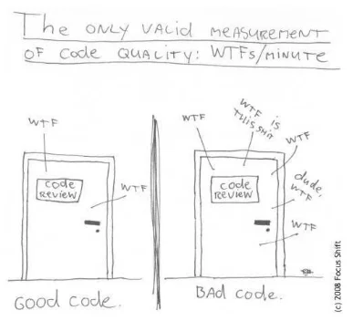

# Clean Code Cheat sheet

## ANTE TODO, CUANDO CODIFIQUES RECUERDA:
- Ser elegante y eficiente
- Ser simple y directo
- Nuestro código debería ser agradable y leerse como una prosa bien escrita.

## Reglas básicas
- Sigue las convenciones.
- Keep it simple, stupid. Cuanto más simple, mejor. Reduzcamos la complejidad.
- Boy scout rule: Dejar el lugar en el que has estado un poco más limpio de como te lo has encontrado.
- Encuentra la raíz del problema.
- Don’t repeat yourself (DRY).

## Estructura del proyecto
__src/main/java__: For source files

__src/main/resources__: For resource files, like properties

__src/test/java__: For test source files

__src/test/resources__: For test resource files, like properties

## Reglas de nombres
- Elija nombres descriptivos e inequívocos.
- Haz distinciones significativas.
- Utilice nombres pronunciables.
- Reemplace los números mágicos con constantes con nombre.

### Clases
- PascalCase
- Sustantivos que las describan suficientemente
### Variables
- camelCase
- Estado o atributo de una clase. Debe describir claramente su intención
### Métodos
- camelCase
- Verbos ya que suelen indicar una acción.

## Reglas de funciones y clases
1. Pequeño.
2. Haz una cosa y hazlo bien.
3. No expongas información interna. Mantén los detalles de implementación ocultos.
4. Es mejor tener muchas funciones que pasar código a una función para seleccionar un comportamiento.
5. Parámetros del método:
    - Restringir la cantidad de parámetros que acepta un método: mejor 3 que 4, pero nunca más de 6.
    - Refactorizar el método si necesita más parámetros de los recomendados.
6. Los métodos se pueden agrupar según su funcionalidad o alcance. No existe una buena
   convención y la idea se debe decidir una vez y luego seguir de manera consistente.

## Archivo de código fuente
### Estructura
1. Declaración del __paquete__ 
2. Declaraciones de importación:
    1. Todas las __importaciones estáticas__ 
   2. Todas las __importaciones no estáticas__
3. Exactamente una __clase__ de alto nivel
    1. __Variables__ de clase 
       1. Constantes
       2. Objetos
       3. El resto
   2. Variables de instancia 
   3. __Constructores__ 
   4. __Métodos__

### Legibilidad
- Indentación
- Espaciados en blanco: Es más fácil leer parrafos cortos que un gran bloque de texto 
- Longitud de línea
- Comentarios:
    - Código autoexplicativo
    - No comentar código
    - Usarlo sólo como aclaración o advertencia de consecuencias.

## GENERAL
- Utiliza los formateadores de código del IDE
- Si utilizas Visual Studio Code, instala plugins de análisis de código, como por ejemplo Error Lens

## BIBLIOGRAFÍA

Material resumen extraído de:

[baeldung.com](https://www.baeldung.com/java-clean-code)

[softensity.com](https://www.softensity.com/blog/clean-code-cheat-sheet/)

[Github davified](https://github.com/davified/clean-code-ml/blob/master/docs/cheat-sheet.md)

Tambien existen guías de convenciones más oficiales como:

[Oracle](https://www.oracle.com/technetwork/java/codeconventions-150003.pdf)

[Google](https://google.github.io/styleguide/javaguide.html)
